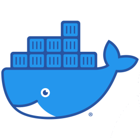
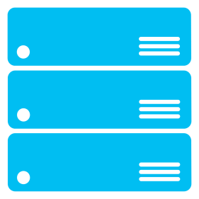
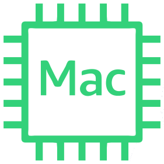
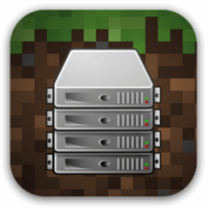
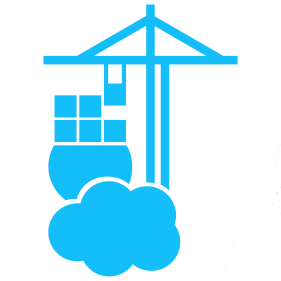

 

   

### Dashboards self-hosted:

- [Heimdall](https://github.com/linuxserver/Heimdall)
- [Homer](https://github.com/bastienwirtz/homer)
- [Dashy](https://github.com/Lissy93/dashy)
- [Flame](https://github.com/pawelmalak/flame)
- [Organizr](https://github.com/causefx/Organizr)
   

                                                                  

